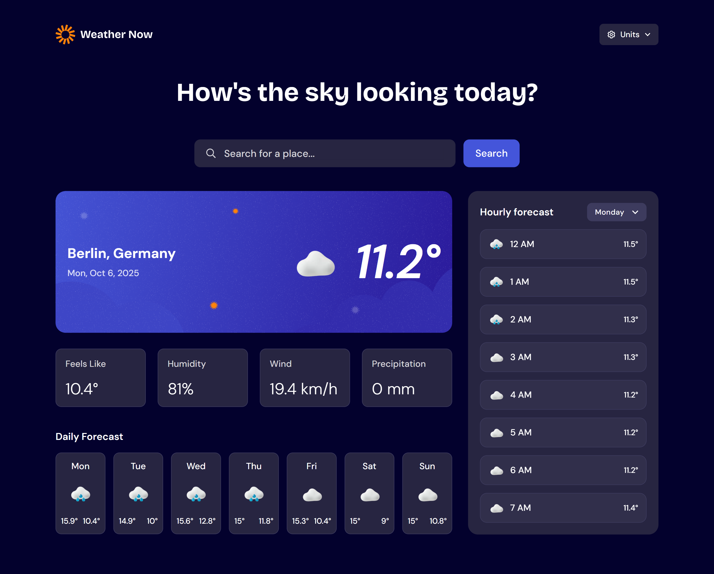

# Frontend Mentor - Weather app solution

This is a solution to the [Weather app challenge on Frontend Mentor](https://www.frontendmentor.io/challenges/weather-app-K1FhddVm49). Frontend Mentor challenges help you improve your coding skills by building realistic projects. 

## Table of contents

- [Frontend Mentor - Weather app solution](#frontend-mentor---weather-app-solution)
  - [Table of contents](#table-of-contents)
  - [Overview](#overview)
    - [The challenge](#the-challenge)
    - [Screenshot](#screenshot)
    - [Links](#links)
  - [My process](#my-process)
    - [Built with](#built-with)
    - [What I learned](#what-i-learned)
    - [Useful resources](#useful-resources)
  - [Author](#author)

## Overview

### The challenge

Users should be able to:

- Search for weather information by entering a location in the search bar
- View current weather conditions including temperature, weather icon, and location details
- See additional weather metrics like "feels like" temperature, humidity percentage, wind speed, and precipitation amounts
- Browse a 7-day weather forecast with daily high/low temperatures and weather icons
- View an hourly forecast showing temperature changes throughout the day
- Switch between different days of the week using the day selector in the hourly forecast section
- Toggle between Imperial and Metric measurement units via the units dropdown 
- Switch between specific temperature units (Celsius and Fahrenheit) and measurement units for wind speed (km/h and mph) and precipitation (millimeters) via the units dropdown
- View the optimal layout for the interface depending on their device's screen size
- See hover and focus states for all interactive elements on the page

### Screenshot

### Links

- Solution URL: [Link to Solution](https://github.com/leonard-ramos27/weather-app-nextjs.git)
- Live Site URL: [Link to Live Site](https://weather-now-app-nextjs.netlify.app/)

## My process

### Built with

- [React](https://reactjs.org/) - JS library
- [Next.js](https://nextjs.org/) - React framework
- [Tailwind](https://tailwindcss.com/) - For styles
- [Shadcn UI](https://ui.shadcn.com/) - UI components
- [SWR](https://swr.vercel.app/) - Data Fetching
- [Zustand](https://zustand.docs.pmnd.rs/getting-started/introduction) - State Management

### What I learned

This is my first ever attempt at making a NextJS App and my first every try joining a Hackathon. I've learned so much with differentiating server and client components as well as using libraries like SWR for fetching data and Zustand for global state management. 

I've known about the Hackathon kind of late and so I only had more than two weeks to do the app. At first I was only planning to use plain React but then I thought this might also be the best time to try NextJS. I've watched a lot of tutorials on how to make NextJS work with other libraries like React Query and Redux however it mostly confused me. At the end, I've tried to just follow the official documentation and it seems to be the best move. I've decided to go with SWR due to its simple setup and I choose Zustand since it's less complex compared to Redux.

My goal was just to implement all the basic requirements and follow the design for the app instead of changing the styles and adding more functionalities due to the time constraint, but if given more time I would love to try adding more features like geolocation detection and favorite locations.

I'm really glad I was able to join a Hackathon since it is something I've always seen other devs do and I have always looked for one that is focused on front end developers. It was very challenging but it was also rewarding with all the new things I've learned.

### Useful resources

- [NextJS Docs](https://nextjs.org/docs) - I've tried watching tutorials for using nextjs but in the end following the documentation is what actually get me there.

## Author

- Frontend Mentor - [@leonard-ramos27](https://www.frontendmentor.io/profile/leonard-ramos27)
- Github - [@leonard-ramos27](https://github.com/leonard-ramos27)
